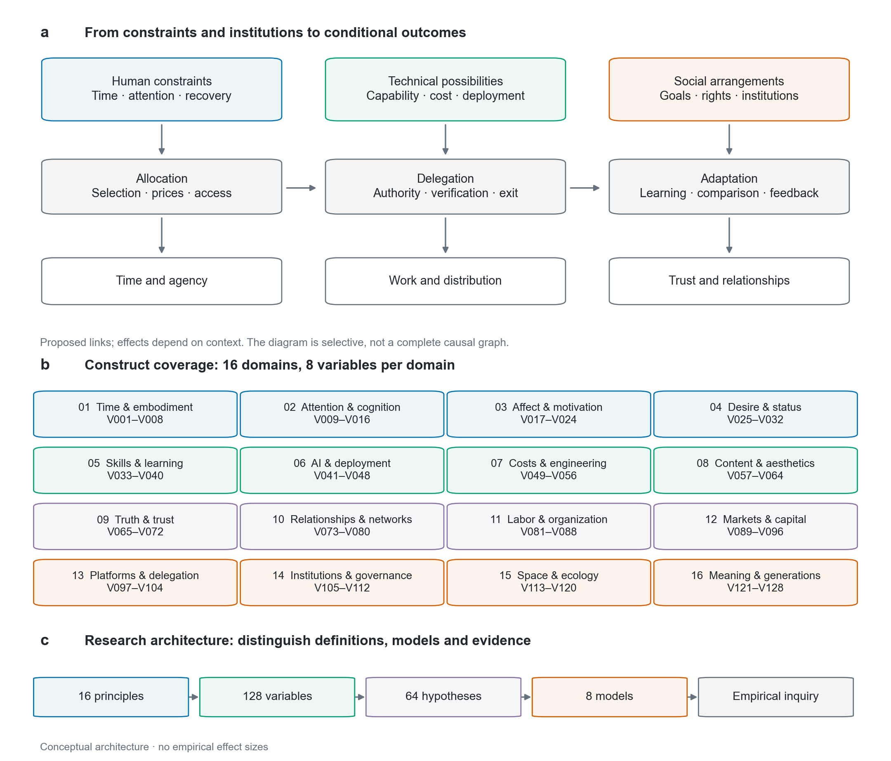
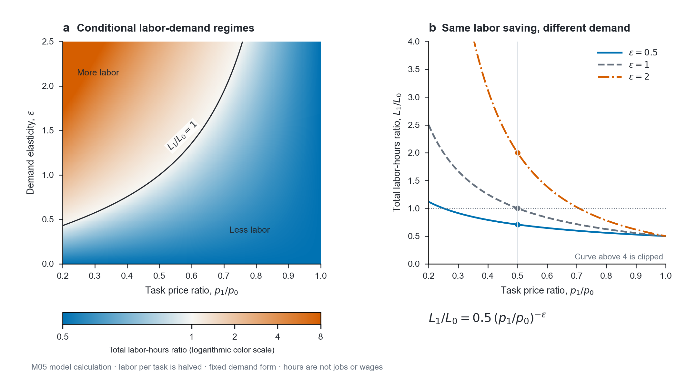
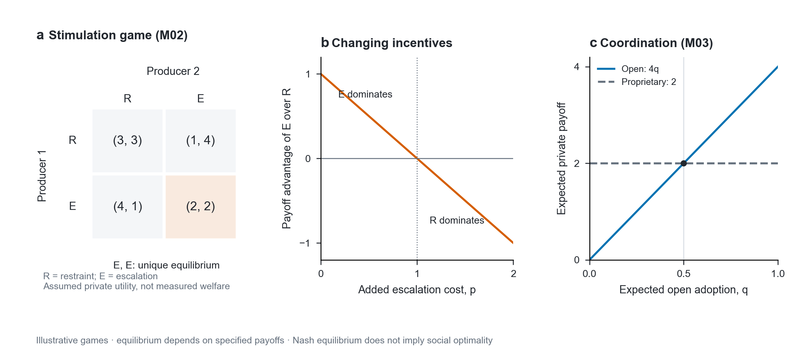
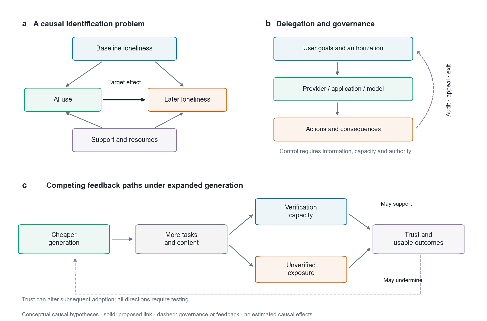

# 第一卷 · AI社会学总纲

## 人的有限性、生成的扩张与社会秩序的重组

**AI社会学 · AI Sociology**

[English](01-foundations.en.md) · [变量图谱](02-variable-atlas.zh-CN.md) · [组合推演](03-derivation-pool.zh-CN.md) · [博弈模型](04-games-and-models.zh-CN.md) · [研究方法](05-research-protocol.zh-CN.md) · [参考文献](REFERENCES.md)

### 摘要

一份报告几分钟就能写完，审阅它的人却仍需逐项核对；一堂课可以反复生成，学生掌握知识仍需要练习；工作省下的时间，也可能很快被新的任务填满。生产变快之后，生活是否随之改善，取决于节省下来的资源怎样使用，又由谁决定。

本文从时间、注意和身体的限制出发，考察人工智能扩大供给后，价格、工作、关系和社会分配怎样变化。全文分为总纲、变量、推演、模型和研究方法五卷，列出 16 项基础原则、128 个变量，以及两项至四项变量相互作用的推演。同一项技术可以减少劳动，也可以提高工作定额；可以扩大受教育机会，也可以让资源充足者先获益。差别往往出在需求、所有权、议价和制度安排之中。

各项推演注明前提、可能出现的相反结果和检验办法，尚待经验研究的部分保留为假说。研究关心的是：当许多事情更容易做到，人能否因此获得更多可支配的时间、更可靠的关系，以及选择自己生活的余地。

**关键词：** 人工智能；有限注意；稀缺性；情绪调节；任务重组；社会比较；委托关系；博弈；制度；价值多元。

### 关于我

我在中国杭州一家人工智能公司工作。这些研究来自我在产品工作中的观察、理论阅读和实践。比起技术又能做什么，我更关心它怎样改变人的时间、工作和关系。

## 1. 研究对象：技术怎样进入人的生活

### 1.1 从能力问题走向社会关系问题

“AI 能做什么”与“AI 的出现让谁能够做什么”是两个相连而不同的问题。前者涉及任务性能，后者还涉及费用、权限、技能、机会和组织安排。一套系统能够生成高质量答案，并不意味着一个学生已经理解答案；能够完成部分工作，也不意味着劳动者拥有节省出来的时间；能够提供持续回应，也不意味着使用者获得了对等的关系。这些差别构成本文的研究对象。

分析单位可以是个人、家庭、工作团队、平台、行业或公共机构，但不能在论证途中不加说明地更换。个人节省二十分钟，不足以直接推出行业就业增加；企业利润上升，也不足以推出社会福祉改善。每次跨层级推断，都需要补上聚合、分配和相互作用的机制。系统层面的效果也不能简单还原为某个使用者的品格或努力程度。

本文采用五个基本问题组织研究：发生变化的是什么任务或关系；谁拥有目标和行动权；成本与收益由谁承担；受影响者有什么真实可行的选择；怎样知道观察到的变化由该机制引起。这五个问题不是为了预先判定技术有害，而是让有益、有害和混合的结果都可以进入同一个可检查框架。

### 1.2 三个相互连接的研究层级

微观层讨论有限时间、认知加工、情绪、欲望、技能和自我理解。中观层讨论家庭、职业、组织和平台如何安排任务、分配可见性、管理责任。宏观层讨论市场、公共制度、基础设施、文化和代际机会。微观状态会影响采用行为，中观安排会改变微观收益，宏观规则又会改变组织的激励。因果作用可以跨层级，但必须说明传递环节和时间顺序。

例如，一个劳动者使用 AI 后产出增加，可以与三种不同生活结果并存：工作时间缩短；工作量同比增加；原岗位被重组而收入下降。要区分这些结果，不能只继续测量模型能力，而应观察劳动需求、考核标准、所有权和议价权。技术解释提供可能性边界，社会解释说明某一可能性为何被实现。

### 1.3 研究范围与知识来源

本框架整理了既有 AI 社会学知识体系、课程与书籍阅读笔记、技术和社会报告摘要，以及围绕内容、工作、关系、教育和判断的专题材料。材料中的重复论点合并为统一变量；叙事案例转化为研究问题；行业预测与个人观察保留其证据等级。阅读笔记不是所涉原著的替代品，未独立核实的数字、引语和企业案例不作为本论文的经验结论。

公开文献提供相邻理论的依据：有限注意、社会比较、信号与信息不对称、任务替代与新任务、博弈和多中心治理等。本文的组织方式是一种综合研究方案，不声称这些问题此前无人研究。尤其不能从一门课程没有展开某个议题，推断整个学术领域忽视了该议题。[R01–R14]

## 2. 命题语法：什么可以称为原则

### 2.1 六种陈述必须分开

| 标记 | 陈述类型 | 可以做什么 | 不能据此做什么 |
|---|---|---|---|
| D | 定义 | 约定研究对象和词语含义 | 以定义代替事实证明 |
| C | 约束 | 指明给定范围内不可忽略的边界 | 推出所有情况下的具体结果 |
| R | 经验规律 | 概括特定证据支持的关系 | 自动外推到所有人、年代和领域 |
| H | 假说 | 提出可能机制与可检验预测 | 以有说服力的叙事冒充验证 |
| M | 模型条件命题 | 在明确假设下推出结果 | 把模型假设当作现实已经满足 |
| N | 规范判断 | 说明应保护什么、怎样权衡 | 以价值立场替代因果解释 |

“人每天只有二十四小时”是指定计时尺度下的约束；“内容增长会加重焦虑”则是需要条件和证据的假说；“平台应该允许用户有效退出”包含规范主张。这些陈述需要不同的论证，不能因为放在同一篇文章里，就被视为具有相同的证明程度。

### 2.2 对“永恒”的有限使用

本文优先使用“在所研究尺度内相对稳定的约束”，而不使用未经限定的永恒人性。生命、注意和身体具有有限性，但其具体容量、分配与支持条件会改变。关系需求广泛存在，也不意味着每个人都需要同一种关系、同样数量的认可。技术发展可以改变环境与能力，不能仅凭今天的经验为未来所有社会写下无条件结论。

稳定约束提供问题的边界；可变参数决定边界内的状态；制度规则决定资源如何进入谁的生活；规范选择决定哪些结果值得追求。只有把这四层分开，“哪些东西不会轻易改变”才会成为有解释力的问题。

### 2.3 形式化的用途与限度

使用公式，是为了暴露假设、标记变量和发现推导遗漏。无法可靠测量的概念可以先用质性比较，不必强行赋值。尤其不能把尊严、自主、金钱、关系和健康加成一个未经解释的总分。需要建模时，应声明单位、函数形式和权重的来源；没有估计的参数，就只承担思想实验中的角色。

**图 1 · 理论结构与变量领域.** a，人的条件、技术供给与制度安排通过资源分配、委托和适应影响生活。箭头仅选取部分待研究的联系，不表示完整因果图。b，16 个领域及其变量编号，每域 8 项。c，原则、变量、假说、模型与经验研究的关系。该图为概念示意，不包含效应估计。

## 3. 十六项基础原则

### P01 · 时间预算与机会成本〔C、D〕

在确定期限内，一个行动者投入某项活动的时间会限制其他活动的可用时间。把任务交给系统可以减少执行时间，也可能新增监督和纠错时间。所谓节省，必须以净时间变化衡量，并问节省部分由谁安排。没有控制权的效率收益，可能表现为更密集的任务，而非更多休息。

### P02 · 注意具有容量与配置边界〔C、R〕

信息可被储存、复制和筛选，人的有效注意却受到任务负荷、身体状态与切换成本影响。外部记忆和自动摘要可能提高有效处理能力，因此不能把“有限”误写成注意能力完全不变。研究需要同时观察供给数量、选择质量和理解效果，而不只统计停留时间。[R01]

### P03 · 身体与恢复不能从模型中删除〔C、H〕

劳动、照护和感受都发生在具身生活中。睡眠不足、疲劳和缺乏支持可能改变使用 AI 的体验，但“情绪能量”不是已证实具有固定容量的自然水箱。情绪调节负担、主观疲劳、习惯化和动机变化需要分别测量。自我损耗研究的重复验证问题提醒我们，不宜把有吸引力的比喻升格为生理定律。[R02]

### P04 · 稀缺性是资源、需要与规则之间的关系〔D、M〕

资源数量有限，不等于该资源在所有场景都稀缺；供给大量增加，也不等于所有人都能够获得。价格、排队、资格和地理位置可能制造实际准入差异。稀缺性需要说明“对谁、相对于什么用途、在什么时间和规则下”。这使研究能够区分自然限制、工程瓶颈和制度排除。

### P05 · 指称性经历与可复制记录不同〔D、H〕

一段聊天记录可以复制，两个人共同承担某次后果的历史却属于特定关系。这里讨论的是经历的指称性，而非预言任何形式的机器经验都不可能存在。不能由记录可复制推出关系完全可替代，也不能由经历独特推出其必定获得市场溢价。独特性、真实性和价格是不同概念。

### P06 · 目标多元，不预设一致也不预设冲突〔D、H〕

用户、劳动者、管理者、平台和公共机构可能共享部分目标，也可能在具体取舍上不同。提高能力可以帮助实现某个目标，但不能逻辑上保证目标自动一致。反过来，存在分歧也不能推出合作不可能；契约、声誉、参与和可执行规则都可能改变激励。研究应记录目标差异发生在哪个结果维度。

### P07 · 能力、部署、权限与结果分层〔D、M〕

任务基准上的成功只是能力证据。实际部署还需要相关数据、维护、可靠性、适配流程和验收标准；进一步采取行动需要合法且恰当的权限；最终结果受到他人反应和环境改变影响。因此，“能做”不能直接写成“已普及”，更不能直接写成“每个人已经受益”。

### P08 · 边际成本与全成本分开〔D、M〕

生成一份文本的费用下降，与一个组织完成可信决策的总费用下降，是两个命题。数据准备、集成、核验、失败、迁移和治理都可能构成重要成本。新增低成本用途还可能扩大总消耗。成本分析既需要质量与期限一致，也需要把被转移给劳动者、用户或公共环境的成本列出。

### P09 · 价值具有多种口径〔D、N〕

市场价格、实际使用价值、交换稀缺性、身份意义和道德地位不能互相替代。一个更便宜的教学服务可能更有用；一个不再稀有的视觉效果仍然可以优美；一个任务的工资下降不会降低执行者的尊严。“贬值”只有在明确口径后才是可研究的命题。

### P10 · 信号效力取决于生成与核验条件〔H、M〕

当某种过去昂贵的表面特征变得容易模仿，它区分潜在质量的能力可能下降。结果可以是普遍不信任，也可以是信任转向可审计记录、长期关系或独立认证。后一条路径也有成本与排斥效应；不能因为需要核验，就预设所有认证都可信。[R03、R04]

### P11 · 偏好会改变，改变的来源需要识别〔R、H〕

人的愿望受到经验、关系、文化和比较影响。个性化系统既可以帮助发现原有需求，也可以改变选择的显著性与期望。要判断影响是否损害自主性，需要考察透明度、可撤回性和用户认可，而不是把所有偏好改变称为操控。社会比较也不意味着所有人永远无法满足。[R05、R06]

### P12 · 相互作用可以非线性并产生反馈〔M、H〕

两个有益工具的组合未必更有益：更快生成加上更弱核验可能扩大错误暴露；更快生成加上可验证流程则可能同时提高速度和质量。阈值、互补、替代、时滞和反馈都能改变简单加法的结果。因此，列出变量之后，还须说明它们怎样相互作用。

### P13 · 分配与权利会改变同一技术的后果〔H、N〕

生产率增长与劳动收入增长之间存在任务需求、所有权和议价等中间环节。技术扩大某项资源的总量，并不决定收益如何分配。对分配是否正当的评价还需说明价值标准：效率、平等、需要、贡献、自由和程序参与可能提出不同要求，不能用其中一项默认代替其他项。

### P14 · 责任需要与信息、能力及权力配套〔H、N〕

在流程上增加一个签字人，并不必然增加实质监督。审核者需要看见相关信息、有时间辨别、有能力纠错，也有权停止流程。责任可以通过组织、合同、保险和公共制度分配；它既可能形成受重视的专业角色，也可能变成没有控制权的负担。不能把“有人负责”当作风险已经消失。[R07]

### P15 · 变化具有多种时钟与尺度〔H〕

模型迭代、工程部署、人的学习和制度修订通常具有不同周期。周期差异可以造成短期过渡成本，但并不是所有利益冲突的唯一原因。即使各环节同步，所有权和目标分歧仍可能存在。还应检查效应在短期、长期，局部与整体之间是否发生符号变化。

### P16 · 开放结论与可修订性构成研究纪律〔N〕

一个分析框架应能够容纳对其不利的证据。如果任何观察都被解释成同一个结论，框架就失去区分能力。本研究要求每条关键假说说明替代解释、失败条件和可能修改。开放性不等于拒绝判断，而是使判断的强度与证据相称。

## 4. 不易改变的约束与可以改变的安排

### 4.1 有限时间不意味着固定命运

人不能在同一段生命中实际经历所有道路，但可以通过教育、工具和协作改变可行选择集。因而有限性不是悲观结论的根据，而是讨论选择质量的起点。如果 AI 把行政事务减少一小时，这一小时可能用于睡眠、照护、学习或新的工作；它的价值依赖使用者是否能够决定用途。

可支配时间还存在显著分布差异。照护者、轮班劳动者和收入不稳定者面对的时间约束，不同于拥有充足支持的人。要求所有人以相同速度更新技能，会把资源差异误写成意志差异。研究需要同时说明时间总量、时间连续性和时间控制权，三者不能用一个“效率”概括。

### 4.2 注意稀缺并不意味着内容零和

在给定时段和受众内，一份内容占用更多注意，可能挤出另一份内容。但信息能够减少搜索、改善决策，也可能让受众发现此前没有接触的主题。社会总的学习效果不能从单一平台的曝光竞争直接推出。注意分配可以具有零和部分，知识积累和合作价值则可能为正和。

Simon 对信息丰富环境中注意问题的讨论，提供了重要出发点，而不是一套适用于所有媒介的固定流量公式。实际研究需要区别发现、理解、记忆、运用与愉悦：一次停留可能只有惊讶，也可能伴随长期理解。以时长代表所有价值，会让理论继承平台指标本身的偏差。[R01]

### 4.3 情绪消耗、恢复与刺激适应

“看得太多，反而没有感觉”可以指疲劳、厌倦、习惯化、价值不匹配或叙事缺乏意义。它们的机制不同，改善条件也不同。更多刺激不一定解决厌倦；降低刺激也不一定恢复兴趣。如果问题来自任务不自主，关键变量可能是控制感；如果来自睡眠不足，形式上的内容创新可能无济于事。

享乐适应研究提醒我们注意体验随重复而改变，但适应速度与程度取决于对象和处境，不能推出所有幸福都会归零。负面体验可能持续，学习也可能使作品越看越丰富。因此模型应允许反应减弱、增强和稳定三种方向，并明确研究的是感官唤醒、满意度还是长期福祉。[R08]

### 4.4 相对位置与足够生活

固定群体里的第一名只有一个，这一排名定义具有排他性。但社会认可并不只有一条赛道，人的愿望也并非只能由名次构成。基本需要满足、亲密关系、专业贡献和公共参与可以具有不同评价尺度。把全部欲望归结为无止境地超过他人，会抹去制度和文化改变比较压力的可能性。

“换一个比较对象”可能帮助某些个体，也无法代替收入保障、合理考核和可获得的公共服务。如果学校或组织仍按固定排名分配关键机会，个人改变心态不能取消结构性竞争。个体解释与制度解释应互相补充，而不是用其中一方否认另一方。[R05]

## 5. 何种东西可能贬值，何种东西可能变得更稀缺

### 5.1 四种不同的贬值机制

第一种是生产价格下降：在质量和用途可比时，新增供给降低某项服务的单位价格。第二种是稀有性下降：过去少数人能够制作的形式，如今更容易获得。第三种是信号效力下降：某种作品形式不再可靠表明作者具备特定能力。第四种是相对收益下降：某技能仍然有用，但相对于其他技能的市场回报减小。

四者可能一起发生，也可能分开。高质量翻译更便宜，可以同时扩大跨语言交流；部分翻译任务的回报下降，并不推出所有语言能力不再重要。某个岗位的任务组合、客户需要和制度资格不同，结果就可能不同。结论应精确到任务、质量、群体和时间，而不是给人的整体智力标注一个下降箭头。

### 5.2 认知服务的价格与人的判断

规则清楚、输出可评估、输入易数字化的认知任务，是分析自动化的自然起点，但这些条件也不是充分条件。真实流程还可能受到数据授权、异常处理和错误代价限制。AI 改变的首先是任务的执行方式，而岗位由多项任务及组织责任组成。[R09]

问题定义、验收与协调可能在某阶段更重要，但不应立即把它们宣布为永久不会被自动化的堡垒。研究应问：这些能力何时成为互补投入，谁有权使用它们，训练机会如何分配，以及其价格是否由需求增长支撑。这些工作的回报也可能改变，需要继续观察。

### 5.3 优质内容丰富之后

优质内容不是统一商品：事实准确、叙事连贯、视觉精美、情感贴切与帮助行动，属于不同质量维度。当形式完成度趋于便宜，受众可能把选择依据转向相关性、作者记录和共同经验；也可能继续偏好低成本的纯感官体验。理论不能替受众预先规定哪一种选择更高级。

供给增长还可能改变发现机制。搜索、推荐和社会影响决定哪些作品获得被评价的机会。文化市场实验表明，社会影响可以改变成功的集中程度和不可预测性，但这不意味着内容质量毫无作用，更不构成某个平台必然产生同样效应的直接证据。[R10]

### 5.4 刺激升级与退出循环

若展示机会主要奖励即时反应，而观众对重复形式的反应减弱，创作者可能不断提高刺激强度。这是一条有条件的竞争路径：需要固定或相对稀缺的展示机会、可被优化的反应指标，以及对长期满意度的弱约束。当受众开始回避强刺激，或评价规则更重视理解和持续满意，升级就可能停止甚至反转。

因此，“越刺激越无效”与“越刺激越占优势”不是无法调和的口号，它们可能发生在不同阶段、不同人群或不同指标上。点击率可以上升而信任下降，短期停留可以增加而长期留存减少。研究必须选择明确结果变量，并对延迟结果保留观察期。

### 5.5 真正稀缺的东西也会变化

在特定情境下，连续时间、可信核验、实际照护、有效退出、真实决策权和稳定关系可能比生成内容更难获得。但“更稀缺”并不自动意味着“更昂贵”或“更公正地获得回报”。照护劳动就是一个重要提醒：社会需要很高，并不保证市场支付充足。

本文不提出一张永久升值资产表，而提出一项分析程序：先观察技术放松了哪个约束，再寻找新瓶颈及其控制者，然后考察瓶颈能否被替代、共享或通过制度缓解。新的稀缺既可能创造专业机会，也可能形成租金与排斥，不能预先赋予正面含义。

**图 2 · 自动化后的劳动需求为何分叉.** 按 M05 计算，假设每项任务所需人工减半，需求函数不变。a，价格比与需求弹性共同决定总人工小时的变化，黑线表示变化为零，色阶采用对数刻度。b，三种弹性下的曲线；圆点对应价格减半。总人工小时不是岗位数量或个人工资。曲线与色阶上限按图示截取，数值均来自假设模型。

## 6. 七条核心机制与分叉路径

### 6.1 生成扩张：从成本下降到选择问题

当边际生成成本下降，潜在供给通常更容易扩大；从潜在供给到实际供给，还需要需求、渠道、计算和组织资源。供给增长可能降低获取门槛，也可能增加重复和噪声。最终结果取决于匹配与核验是否同步改善，以及新增内容是否真的服务于尚未满足的需要。

一条有益路径是低成本供给加上高质量检索，让少数语言或小众任务得到服务。另一条路径是数量扩张加上弱核验，让辨别负担被推给用户。两者可以并存于同一平台。比较时应测量受益者与受损者，而不只测量总发布量。

### 6.2 委托链：从建议到行动

委托可以分成信息检索、建议、选择、执行和持续授权。每一层都应说明委托目标、信息边界、行动范围和撤回方式。系统给出建议，仍可由人决定；系统持续行动，则需要对未来情境下的授权作出安排。不能把所有层级统称为“使用了 AI”后分析统一影响。

委托释放认知负担的同时，也可能增加对服务的依赖。若可迁移的数据、清楚的记录和替代供应存在，依赖未必构成严重限制；若个人历史、工作流程和关系入口集中在单一服务中，退出成本可能随使用增长。由便利走向依赖的路径，需要通过长期观察而非单次体验判断。

### 6.3 价格锚与任务重组

新技术可能改变买方对合理价格和交付速度的预期。原来收费的部分任务变得便宜，买方可能要求更低报价、更大产量或更完整服务。劳动者的结果取决于是否能够进入互补任务，以及新增需求能否抵消替代。任务替代、任务创造和需求扩张需要同时进入模型。[R09]

某些人可能在短期受损而行业在长期扩张；行业扩张也未必补偿同一批人的损失。讨论“最终会有新工作”不能省略转型时间、地区和技能匹配。分配分析要追踪具体群体，而不是用不同时点的总人数代替同一个人的经历。

### 6.4 信号变化与核验基础设施

当高完成度文本、声音或图像更易生成，人们可能重新评估它们证明身份、能力和事实的作用。原有信号失效不必导致普遍怀疑：可靠来源、独立测试和可审计过程可能提供新的依据。但是核验者自身也有激励和能力问题，需要接受核查。[R03、R04]

这里存在一条二阶问题：如果核验本身也被自动化，什么条件下可以信任核验结果？答案不能无限后退到更多形式标签，而应回到独立性、抽样、可重复性、错误披露及纠正机制。合理信任建立在可检查和可修复的安排上，并不要求个体亲自重复全部专业工作。

### 6.5 技能形成与认知卸载

工具可以通过及时反馈和更多练习促进学习，也可能在替代练习后减少独立能力。需要区分“借助工具完成得更好”和“离开工具仍然学会了”。两种结果都可以有价值，但对职业适应和教育目标的意义不同。

熟练直觉通常需要可学习的环境与有效反馈，不能只凭经验年限推定。AI 生成的流畅反馈如果并不准确，可能让错误更加稳定；若反馈可核验且任务安排保留主动尝试，也可能加快掌握。研究应把即时表现、延迟保持和跨任务迁移分别测量。[R11]

### 6.6 关系补充与关系替代

低门槛、持续回应的系统可能帮助表达、练习和获得信息，也可能改变人对现实互动的期待。结果取决于既有支持网络、使用方式、商业目标和关系摩擦的类型。对缺少支持的人，新增回应可能是有价值的补充；对已有支持但逐步回避现实互动的人，机制可能不同。

不能把“使用者更孤独”直接解释成“使用导致孤独”，因为原本孤独的人也可能更愿意使用。还应区分互动频率、主观被理解、实际帮助、互惠与数据暴露。本文保留相反路径，而不把某一种技术关系预先定义为真实关系的敌人或替代答案。

### 6.7 制度反馈与集体行动

如果个体各自追求短期优势，却共同加重核验、刺激或工作负担，就有必要研究集体行动与规则协调。纳什均衡描述在给定策略与收益下无人愿单方面改变的状态，不等于社会最优，也不保证现实会自动到达该状态。[R12]

规则改变能够调整收益结构，但设计规则还要考虑执行成本、代表性和新的排斥。多中心治理提供了一种研究视角：不同规模的组织和公共安排可能共同处理问题，没有必要预先认定单一中心或完全自发秩序适用于一切情境。[R13]

## 7. 从两个变量到四个变量

### 7.1 双变量：确定最小机制

双变量分析不是看见两个概念就连接箭头。必须说明输入变化、结果变量和保持不变的背景。例如“内容供给上升＋注意预算有限”只有在受众、期限和选择机制固定时，才可能推出单份内容平均获得的注意下降。若新增内容替代无效搜索，理解效果可能改善；若扩大了受众范围，单份关注也未必下降。

双变量卡应给出两种不同情境下的结果，并标出可以观察的区别。它的目标是形成可研究的最小对照，而非以两个词概括全部社会。某个机制不成立，既可能因为输入没有发生，也可能因为中间机制被其他条件阻断。

### 7.2 三变量：寻找使结果翻转的条件

第三个变量常作为调节条件。例如生成成本下降与任务可替代度提高，可能压低部分劳动需求；加入任务需求弹性后，低价格引发的扩量可能抵消一部分替代。此处不是三个名词相加，而是第三项改变前两项关系的强度或方向。

还应区别调节与中介。核验成本如果是供给扩张之后产生的结果，它可能处于因果链中；若是事先存在的检查制度，它又可能改变扩张的影响。变量在模型中的角色由时间与研究问题决定，不能仅凭变量名称固定。[R14]

### 7.3 四变量：连接技术、行为、制度与结果

四变量模型适合表达交叉条件，例如任务能力、核验能力、监督跨度与责任分配共同决定人类审核是否有效。只有责任而没有能力和时间，可能产生形式签字；足够能力、可控制负荷和停止权共同存在时，审核才更可能发挥作用。这里的结果仍需实测，不能因为四项齐全就宣布安全已经得到保证。

组合复杂度增长迅速。128 个变量共有 8,128 个无序二元组合、341,376 个三元组合和 10,668,000 个四元组合。它们是候选组合，不是已经成立的 11,017,504 条因果规律。本项目提供可枚举工具，并展开 64 张机制卡；其余组合可按同一语法补充。因果方向、时间顺序和多种状态还会产生更多模型，因此不声称穷尽现实。

### 7.4 八种组合算子

| 算子 | 研究问题 | 典型条件 |
|---|---|---|
| 加总 | 两种负担是否累积 | 测量尺度可比较，避免重复计算 |
| 互补 | 一项投入是否提高另一项的效果 | 联合使用与单独使用可比较 |
| 替代 | 一项是否减少对另一项的需要 | 明确任务与质量标准 |
| 瓶颈 | 最弱环节是否限制整体 | 阶段之间确有必要依赖 |
| 阈值 | 达到某强度后机制是否改变 | 有足够阈值两侧观察 |
| 反馈 | 结果是否反过来改变输入 | 时间顺序与循环时滞明确 |
| 调节 | 第三变量是否改变关系 | 区分交互与分组相关 |
| 分配 | 总结果如何落到不同主体 | 记录群体、权利与成本承担者 |

它们是构造问题的方式，不是新的自然定律。一个研究可以使用多种算子，但每多加入一种，就增加了需要识别和核实的假设。

**图 3 · 刺激竞赛、激励改变与协调.** a，M02 的假设收益矩阵，双方升级构成唯一纳什均衡。b，升级的附加代价超过 1 时，克制转为严格占优策略；等于 1 时无差异。c，M03 中对他方采用开放标准的预期超过 1/2 后，开放策略的期望收益更高。这是两类不同博弈，不是平台实测结果。

## 8. 博弈论的位置：解释互动而非装饰文字

### 8.1 先写参与者，再谈均衡

一个博弈至少要明确参与者、可选策略、信息、收益和行动顺序。创作者、平台和受众并不天然拥有同一个目标；受众也不是一个统一的人。把收入、学习、满意度和声誉放进收益函数时，需要说明采用谁的评价与什么期限。缺少这些信息，使用“纳什均衡”通常只是在给现象换名称。

第四卷给出刺激竞赛、协调、安全审核和议价等模型。数字只用于展示逻辑，不能作为平台实证或行为参数。改变收益参数后，均衡可能改变，甚至出现多个均衡。研究真正关心的，是现实制度使哪类收益关系成立，以及哪些干预可能改变它。

### 8.2 均衡不等于满意，竞争不等于效率

在一个囚徒困境形式的刺激竞赛中，双方可能都宁愿共同克制，却各自有升级动机。但如果强刺激已经降低收益，或者长期声誉进入计算，原来的收益排序就可能不成立。应先检验博弈结构，再选择均衡概念，不能看到竞争便套用囚徒困境。

同样，协调问题中的低采用状态与利益冲突中的低福利状态需要不同解释。前者可能需要标准与共同预期，后者可能需要改变收益和权利。将两者混同，会导致只靠“大家理解技术”就试图解决利益分配问题。

### 8.3 有限理性与演化

现实行动者的目标可能不清楚，策略集合可能随技术变化，学习与模仿也会改变行为。静态均衡只是分析起点。可以进一步研究重复互动、声誉、网络扩散和制度学习，但复杂模型并不自动更接近现实。模型应与可以获得的数据和具体问题相匹配。

## 9. 理论怎样回到人的目标与焦虑

### 9.1 把无法回答的大问题拆成可判断的小问题

“我会不会被 AI 替代”包含任务、收入、身份和机会等多个层次。拆分后可以分别研究：哪些任务已具备替代条件，哪些任务仍需要互补投入，组织是否改变报酬方式，个人能够接触哪些转型资源，以及哪些成本需要集体安排承担。拆分提供行动依据，却不承诺消除所有风险。

同理，“我是不是落后了”需要明确比较对象与真实目标。追踪每个新工具未必服务于某个人的生活目标。合理的知识选择取决于实际任务、可投入时间和可验证收益；但是资源不足造成的困难，也不能被归因于“目标不清晰”。个人目标与公共条件应同时可见。

### 9.2 三种不同的确定性

技术预测的确定性、制度承诺的确定性和个人价值取舍的确定性，并不相同。一个人可以无法确定某模型何时普及，却清楚自己重视哪些关系与工作条件；也可能非常了解工具性能，却仍然缺少稳定收入与可退出的选择。增加技术知识并不能替代社会保障，但可以帮助识别哪些判断有依据。

本文的规范取向是扩大人们有理由认可的可行选择，保护解释、质疑、拒绝和参与的空间。这是公开的价值立场，不被包装为从技术参数必然推导出的结论。不同读者可以接受分析工具，同时对具体分配原则持有不同意见。

### 9.3 缓解焦虑的理论条件

使不确定性变得可分解、使风险有承担者、使行动有可行路径，可能比反复宣布未来光明更有帮助。然而这是需要研究的机制假说，而非心理治疗承诺。部分焦虑来自真实处境；理论的责任是把处境说清楚，不能以安慰要求人接受不合理安排。

有效沟通应同时给出已知、未知和可观察的变化。文学意象可以帮助理解时间与选择，但不能代替证据；金句可以浓缩问题，但不能删除决定结论的条件。理论表达越容易被复述，越应确保复述之后仍保留其边界。

**图 4 · 因果识别、委托与反馈.** a，既有孤独与支持条件可能同时影响使用及后续孤独，简单相关不能识别中间的目标效应。b，目标授权、服务执行与后果之间，需要可实际使用的审核、申诉和退出。c，供给扩张可以伴随核验改善，也可以扩大未核验信息暴露；信任又可能影响后续采用。实线为假定联系，虚线为治理或反馈联系，均待经验检验。

## 10. 研究议程：保留尚未闭合的问题

第一组问题涉及稀缺迁移：当生成成本下降，瓶颈究竟转向检索、核验、关系还是资源接入？不同群体是否面对不同瓶颈？是否存在技术让多项约束同时缓解，而没有出现同等严重新瓶颈的情况？后一个问题是框架必须认真允许的反例。

第二组问题涉及分配：生产率收益在工资、利润、价格、税收和可支配时间之间如何分配？哪些制度能改变分配，成本是什么？判断某种治理安排有效，需要同时测量其保护作用与可能造成的排除，不能只记录规则是否出台。

第三组问题涉及学习和关系：何种工具安排增加主动练习，何种安排只提高即时完成度？持续回应怎样影响不同人群的实际支持网络？研究需要追踪长期结果并保留使用者的叙述，不能只用单次满意度解释生活变化。

第四组问题涉及文化与目标：当人们面对更多可选内容和生活脚本时，可行选择是否真的扩大？共同事实如何维持？不同群体如何协商不能完全换算的价值？这些问题可能需要实验、调查、访谈、历史比较和制度研究共同推进。

第五组问题涉及理论本身：哪些变量实际可以合并，哪些重要因素仍然缺席？哪些机制只是相同现象的不同描述？哪些推演会被新的证据推翻？后续修订将据此合并重复概念，补充遗漏条件，并删除不成立的解释。

## 11. 阅读与使用约定

总纲提供概念和原则；第二卷提供变量定义及候选测量；第三卷提供 64 张条件性机制卡；第四卷展示可复查的形式模型；第五卷规定证据、识别、修订与引用方法。变量编号 V、原则编号 P、推演编号 D、模型编号 M 和文献编号 R 用于跨卷定位，不构成对命题真伪的等级判断。

阅读任何一条路径，都应同时阅读它的相反分支。若要形成公开预测，应进一步写明时间窗口、观察指标、基准概率或可比较基线，以及什么事件会使预测撤回。若只是进行思想实验，应保留思想实验标记。保留前提与修订记录，读者才能判断一项解释在何处成立，又在何处失效。

---

**引用建议：** AI社会学（2026）。《AI社会学：人的有限性、生成的扩张与社会秩序的重组》。引用具体命题时请附章节或编号。完整书目信息见[参考文献](REFERENCES.md)。
