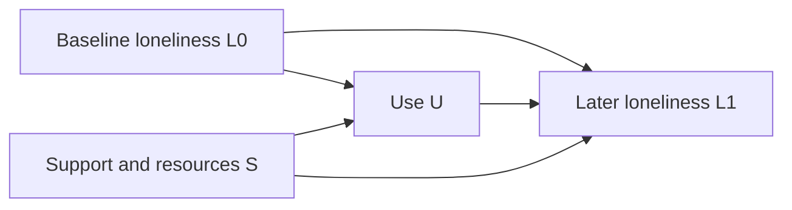

# Volume V · Evidence, identification and research protocol

[中文](05-research-protocol.zh-CN.md) · [Foundations](01-foundations.en.md) · [References](REFERENCES.md)

## 1. Theory, observation and evidence

Theory explains how specified conditions could produce an outcome. Empirical research examines where those conditions hold and whether the outcome occurs. Neither substitutes for the other. A product demonstration may establish that a task is feasible; it cannot alone establish improvements in earnings, educational opportunity or social relationships.

Reading notes and practitioner experience can motivate questions. Their evidential value depends on their scope and sources. Specific research claims require consulting original studies and distinguishing findings, interpretations and conjectures. Repetition of one claim does not create independent evidence.

The [references](REFERENCES.md) identify the literature and its limits. Principles, variables, mechanisms and models address distinct questions: which conditions matter, how change can be measured, how effects might be transmitted, and how outcomes depend on assumptions.

## 2. Conditions behind common propositions

| Potentially absolute proposition | Necessary distinctions |
|---|---|
| Attention cannot be parallelized or stored | Distinguish attention, records, memory, switching and external assistance |
| Capability continuously improves and costs continuously fall | Conditional task- and horizon-specific trends permitting reversal |
| Goals do not align automatically | Preserve the logical distinction while permitting cooperation and alignment |
| Social desires never saturate | Study saturation by need, reference group, institution and culture |
| Emotion is a fixed consumable resource | Separate regulation, fatigue, motivation, recovery and adaptation |
| Responsibility makes signatories more valuable | Add information, competence, time, authority and bargaining conditions |
| Engineering changes speed but never direction | Allow changes in feasibility, costs and adoption direction |
| Inclusion necessarily deepens dependence | Separate access, portability, substitutes, objectives and actual exit |
| All reasoning must return to one conclusion | Use branches, rival explanations and admissible counterexamples |

## 3. Evidence classification

| Source type | Appropriate use | Required context |
|---|---|---|
| Original theory | Concepts, assumptions and deductions | Original assumptions; not contemporary AI validation |
| Randomized experiments | Effects within studied samples and interventions | Randomization unit, adherence, attrition and intervals |
| Quasi-experimental and observational studies | Relations or effects under identification assumptions | Confounding, selection, time trends and sensitivity |
| Qualitative and historical studies | Processes, meaning, mechanisms and institutional differences | Case selection, sources, counterexamples and rivals |
| Official statistics and technical evaluations | Quantities or performance under stated definitions | Date, population, denominator, version and coverage |
| Vendor claims and industry forecasts | Claims, leads and scenarios | Interests, forecast status and methods |
| Notes and practitioner experience | Questions and candidate mechanisms | Secondary status, scope and unverified components |

There is no universal evidence ranking independent of the question. Experiments can be narrow, while interviews reveal mechanisms omitted by scales. Agreement across methods can be valuable, but multiple sources repeating one unverified claim are not independent corroboration.

## 4. Minimum study registration

```text
Study ID:
Related P / V / D / M:
Question and target population:
Unit, region, task and horizon:
Treatment or input change:
Primary outcome and measurement:
Prespecified mediators, moderators and confounders:
Branch A conditions and prediction:
Branch B conditions and prediction:
Main rival explanation:
Identification strategy and necessary assumptions:
Sampling, missingness and attrition:
Primary tests, smallest meaningful effect and power:
Multiplicity and exploratory-analysis labels:
Results that would weaken or reject the explanation:
Ethics, consent, data minimization and withdrawal:
Findings, uncertainty, generalization limits and revisions:
```

Specify primary outcomes and subgroups before inspecting results. An underpowered nonsignificant result does not prove zero effect. Equivalence testing requires a prespecified negligible-effect interval. Affect and relationship measures should not be used to assign individual clinical diagnoses.

## 5. Three identification traps

**Selection and reverse causation.** A relationship between AI use U and loneliness may arise because prior loneliness L₀ affects both U and later loneliness L₁. Record baselines, randomize availability where appropriate, or use a suitable longitudinal design rather than simply subtracting users from nonusers.



Arrows express causal assumptions, not facts discovered from data. The graph allows U→L₁ while showing why correlation alone cannot estimate it. Arbitrarily controlling post-treatment mediators or colliders can introduce bias. [R14]

**Common shocks.** A tool launch accompanied by a recommendation change cannot isolate the tool's income effect through a simple before-and-after comparison. Difference designs also require assumptions such as parallel trends, comparable groups and no relevant concurrent interventions. A method's name does not establish causality.

**Levels and denominators.** Less time per task need not reduce total hours per person. Higher income among users need not be caused by tools. More content with a lower hit rate does not by itself establish a constant attention budget. Record totals, distributions, denominators and horizons together.


**Figure 4 · Identification, delegation and feedback.** a, Baseline loneliness and support can affect both use and later loneliness, preventing simple correlation from identifying the target effect. b, Delegation requires usable audit, appeal and exit between authorization, service execution and consequences. c, Expanded supply can accompany better verification or greater unverified exposure; trust may affect subsequent adoption. Solid links are proposed relations; dashed links denote governance or feedback. All require empirical examination.

## 6. From a theory pool to auditable forecasts

A forecast should state: under conditions C, within horizon T and population G, outcome Y is expected to change relative to baseline B; observation Z would reduce confidence or trigger withdrawal. Probabilities require defined events, deadlines, data sources and resolution rules. Do not fabricate precision without grounds for calibration.

Scenarios can cover continuing conditions, relaxed constraints and changed institutions. Three scenarios do not imply three equally probable futures. Retain failed forecasts and distinguish factual, timing, mechanism and observability errors instead of extending deadlines indefinitely.

## 7. Candidate combinations and expansion

The 128 variables yield 11,017,504 unordered tuples of order two through four. The paginated enumerator can cover the entire candidate set. It does not establish independence, causal direction or identification. It enumerates distinct variables, not states, temporal orders, cycles or hidden variables.

```bash
python3 scripts/explore_theory.py --stats
python3 scripts/explore_theory.py --variables V009 V057 V098 V097 --order 3 --limit 4
python3 scripts/explore_theory.py --order 4 --offset 1000 --limit 20
```

A new card requires input changes, outcomes, assumptions, two branches and a challenge to the explanation. Four words do not constitute a derivation. A crucial fifth condition should be explicit, with a higher-order model where needed, rather than hidden inside “all else equal.” Religion, war, family institutions and gender structures require dedicated measurement and designs; broad variables do not claim to explain them fully.

## 8. Limits of explanation

Literature, allegory and science fiction can construct thought experiments that clarify the costs of a choice. Fictional premises are not empirical sociology and do not establish forecast credibility. The same distinction applies to models: internal consistency makes testing possible but does not establish that reality follows the model.

An explanation deserves consideration when it defines its scope, distinguishes rival accounts and remains open to adverse evidence. Revising conclusions in response to evidence does not make all claims equally credible. The distinction lies in the reasons offered and whether those reasons withstand examination.

Use the [research proposal template](templates/research-proposal.md) to specify questions, assumptions and tests.
