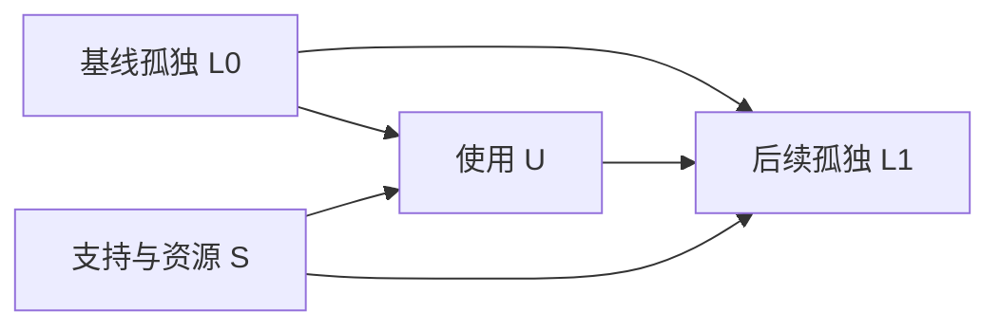

# 第五卷 · 证据、识别与研究协议

[English](05-research-protocol.en.md) · [总纲](01-foundations.zh-CN.md) · [参考文献](REFERENCES.md)

## 1. 理论、观察与证据

理论说明一组条件如何导向某种结果，经验研究检验这些条件在何处成立、结果是否出现。二者不能互相替代。产品能力的展示能够说明一项任务是否可行，却不能单独证明劳动收入、教育机会或社会关系因此改善。

阅读笔记和实践经验可以提出问题，其证明力取决于观察范围和材料出处。引用具体研究时，应回到原始文献，区分作者的发现、解释与推测。同一观点被多次转述，并不会增加独立证据。

本体系的文献依据及适用边界见[参考文献](REFERENCES.md)。原则、变量、机制与模型分别回答不同问题：哪些条件应被考虑，如何测量变化，变化可能通过什么过程传递，以及结果如何随假设改变。

## 2. 常见命题的适用边界

| 容易被绝对化的命题 | 必须区分的条件 |
|---|---|
| 注意不可并行、不可存储 | 区分有效注意、信息记录、记忆、切换和工具辅助，不用物理隐喻代替认知测量 |
| 能力会持续进步、成本会持续下降 | 作为具体任务与期限下的条件性趋势，允许停滞、反转及质量口径变化 |
| 目标不会自动一致 | 保留逻辑区分，同时允许合作、协商及真实利益一致 |
| 社会性欲望永不饱和 | 改为按需要类型、参照群体、制度和文化研究不同饱和模式 |
| 情绪是一种固定消耗品 | 分开情绪调节、疲劳、动机、恢复和适应；不预设固定资源模型 |
| 责任让签字者更值钱 | 加入信息、能力、时间、权力及议价条件，允许责任负担化 |
| 工程只改变速度，不改变方向 | 工程和生态条件可能改变速度、成本、可行性与采用方向 |
| 普惠必然加深依赖 | 区分接入、可携性、替代供应、目标控制与实际退出 |
| 一切推演必须回到同一主结论 | 改为条件分支、竞争解释和允许反例 |

## 3. 证据分类：来源信誉不代替方法

| 类型 | 可支持的用途 | 必须保留的信息 |
|---|---|---|
| 原始理论论文 | 概念、假设和推导 | 原始假设；不能直接当作当代 AI 实证 |
| 随机实验 | 在研究样本和干预下估计效应 | 随机单位、依从、流失、效应与区间 |
| 准实验与观察研究 | 在识别假设下分析关系或效应 | 混杂、选择、时间趋势与敏感性 |
| 质性及历史研究 | 解释过程、意义、机制和制度差异 | 案例选择、材料来源、反例与替代解释 |
| 官方统计、技术评测 | 指定口径的数量或性能 | 时间、总体、分母、版本及覆盖边界 |
| 厂商自述与行业预测 | 提供主张、线索与情景 | 利益位置、预测性质、估计方法 |
| 阅读笔记与实践经验 | 提出问题、形成候选机制 | 二手属性、观察范围、未验证部分 |

证据没有脱离研究问题的一维排名。实验也可能样本狭窄；访谈可以发现量表没有捕捉的机制。跨多种方法一致的结果通常更有解释价值，但“多个来源”如果都转引同一条未经核实的消息，就不是独立互证。

## 4. 每项研究的最小登记表

```text
研究编号：
对应 P / V / D / M：
问题与目标总体：
分析单位、地区、任务、期限：
处理或输入变化：
主要结果及测量方式：
预先定义的中介、调节和混杂因素：
分支 A 的条件与预测：
分支 B 的条件与预测：
最重要的替代解释：
识别策略与必要假设：
样本来源、缺失与流失处理：
主要检验、最小有意义效应与统计功效：
多重比较与探索性分析标记：
什么结果会削弱或推翻本解释：
伦理、知情、数据最小化与撤回安排：
结果、不确定性、外推边界及修订记录：
```

研究前说明主要结果和分组，避免看到数据后不断寻找显著关系。没有足够功效的“不显著”，不等于证明效应为零。等效性检验需要预先规定可忽略差异的范围。涉及情绪和关系的指标，不应据此给个人作临床诊断。

## 5. 因果识别：三个常见陷阱

**自选择与反向因果。** AI 使用 U 与孤独 L 相关，可能来自先前孤独 L₀ 同时影响 U 和后续 L₁。宜记录基线、随机化可得条件或使用合适的纵向设计；不能简单把使用更多的人与不使用的人相减。



图中的箭头是待说明的因果假设，不是已由数据发现的事实。图允许 U→L₁ 存在，也显示简单相关不足以估计它。不得为了得到想要的效应而任意控制变量：处理后的中介和碰撞点可能引入偏差。[R14]

**共同冲击。** 平台上线某工具后同时调整推荐规则，创作者收入改变可能来自两项变化或外部需求。前后比较需要识别共同变化；差分设计仍依赖平行趋势、无相关干预和可比较组等假设，不能仅凭用了方法名称就宣布因果。

**跨层级与分母。** 每项任务用时下降不等于每人总工时下降；低成本工具的用户平均收入高不等于工具提高了收入；内容总量上升而爆款比例下降，也不能单独证明注意预算恒定。必须同时记录总量、分布、分母和时间窗。


**图 4 · 因果识别、委托与反馈.** a，既有孤独与支持条件可能同时影响使用及后续孤独，简单相关不能识别中间的目标效应。b，目标授权、服务执行与后果之间，需要可实际使用的审核、申诉和退出。c，供给扩张可以伴随核验改善，也可以扩大未核验信息暴露；信任又可能影响后续采用。实线为假定联系，虚线为治理或反馈联系，均待经验检验。

## 6. 从理论池形成可核查预测

预测格式应为“在条件 C、期限 T 和总体 G 下，指标 Y 相对基线 B 预计如何变化；如果观察到 Z，则降低信心或撤回”。概率预测应定义事件、截止时间、数据源及结算规则；没有校准依据时，不制造看似精确的百分比。

可以建立三类情景：条件维持、约束缓解、制度改变。情景描述本身不代表三种等概率未来。回看预测时保留失败项，区分事实错误、时间错误、机制错误与不可观测问题，不通过不断延后日期维持表面正确。

## 7. 候选组合、覆盖与扩展

128 项变量的二至四元无序组合计 11,017,504 项。枚举器可分页输出全部候选元组；它没有证明变量独立、方向合理或因果可识别。工具只枚举互异变量，不自动枚举状态、顺序、循环和隐藏变量。

```bash
python3 scripts/explore_theory.py --stats
python3 scripts/explore_theory.py --variables V009 V057 V098 V097 --order 3 --limit 4
python3 scripts/explore_theory.py --order 4 --offset 1000 --limit 20
```

新增一条机制卡，必须明确具体输入变化、结果、假设、两个分支和反证；仅列出四个词不算完成推演。若新增第五个关键条件，应明确写入边界，必要时另建更高阶模型，不把它隐藏在“其他条件不变”之中。领域清单可以继续扩展；宗教、战争、家庭制度、性别结构等问题需要专门测量和研究设计，不能声称已经由宽泛变量充分解释。

## 8. 解释的限度

文学、寓言和科幻可以构造思想实验，帮助辨认某种选择的代价。但作品设定不是社会学实证，也不使某个预测天然可信。模型同样如此：内部逻辑一致，是接受检验的起点，并不足以说明现实必然按模型运行。

判断一个解释是否值得保留，应考察它能否明确适用对象、区别竞争解释，并接受不利证据。结论随证据改变，不意味着所有判断都同样可靠；区别在于哪些判断说明了理由，哪些理由经得起检查。

研究问题、假设与检验方式可按[研究提案模板](templates/research-proposal.md)展开。
