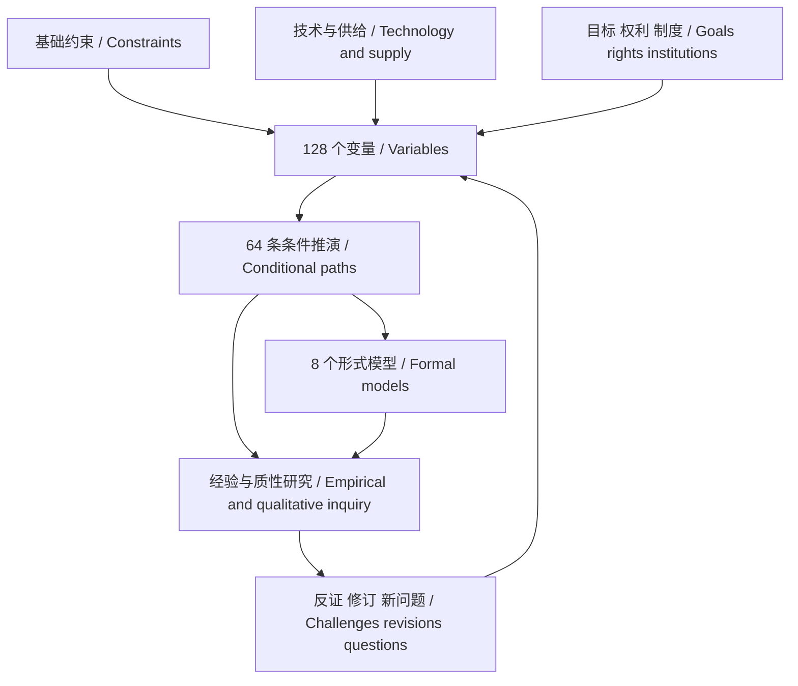

# AI社会学 · 理论体系

**人的有限性、生成的扩张与社会秩序的重组**

*Human Finitude, Expanding Generation, and the Reorganization of Social Order*

研究版 / Research edition **0.1.0** · **2026-09-22** · 工作论文 / Working paper

当答案和服务更容易获得，人的时间、选择、关系和工作会怎样改变？本体系用可定义的变量、条件性的推演和可检查的模型研究这个问题。理论的厚度来自机制、边界与反例，而不依赖预先确定的未来。

How do time, choice, relationships and work change as answers and services become easier to obtain? This framework studies that question through defined variables, conditional derivations and inspectable models. Its depth rests on mechanisms, boundaries and counterexamples rather than a predetermined future.

## 五卷目录 / Five volumes

| 卷 / Volume | 内容 / Contents | 中文 | English |
|---|---|---|---|
| I | 总纲与 16 项基础原则 / Foundations and 16 principles | [阅读全文](01-foundations.zh-CN.md) | [Read](01-foundations.en.md) |
| II | 16 个领域、128 个变量 / 16 domains and 128 variables | [变量图谱](02-variable-atlas.zh-CN.md) | [Variable atlas](02-variable-atlas.en.md) |
| III | 32 条双变量、20 条三变量、12 条四变量路径 / 64 conditional paths | [推演池](03-derivation-pool.zh-CN.md) | [Derivation pool](03-derivation-pool.en.md) |
| IV | 8 个可复算模型 / 8 reproducible models | [博弈与模型](04-games-and-models.zh-CN.md) | [Games and models](04-games-and-models.en.md) |
| V | 来源映射、证据与识别 / Source map, evidence and identification | [研究协议](05-research-protocol.zh-CN.md) | [Research protocol](05-research-protocol.en.md) |

[参考文献 / References](REFERENCES.md) · [研究提案 / Research proposal](templates/research-proposal.md) · [变量数据 / Variables](data/variables.json) · [路径数据 / Pathways](data/pathways.json)

## 体系结构 / Architecture



## 命题与编号 / Claims and identifiers

P01–P16 为原则；V001–V128 为变量；D001–D064 为推演；M01–M08 为模型；R01–R15 为参考文献。命题地位另以 D 定义、C 约束、R 经验规律、H 假说、M 条件模型、N 规范判断标记。编号中的 D/R 与命题类型中的 D/R 是两个命名空间；例如 D001 的命题类型是 H，不是定义。

P denotes principles, V variables, D derivation cards, M models and R references. Claim status separately uses D definition, C constraint, R regularity, H hypothesis, M conditional model and N normative judgment. Identifiers and claim types are distinct namespaces: D001 is a hypothesis, not a definition.

## 从任意组合开始 / Start from any combination

```bash
python3 scripts/explore_theory.py --stats
python3 scripts/explore_theory.py --variables V009 V057 V098 V097 --order 3 --limit 4
python3 scripts/check_theory.py
```

在仓库根目录运行。全部二至四元候选组合共 **11,017,504** 项；枚举覆盖这个有限目录的无序组合，不证明它们具有因果关系，也不声称穷尽所有现实变量。64 条机制卡是展开的研究起点。

Run from the repository root. There are **11,017,504** candidate tuples of orders two through four. Enumeration covers unordered combinations in this finite catalog, not causal validity or every real-world factor. The 64 cards are developed starting points.

## 作者 / Author


**AI社会学 / AI Sociology**

中国杭州一家 AI 公司的从业者，从 AI 产品、理论阅读与实践问题中持续积累研究。独立工作论文，不代表所在机构立场，不宣称同行评议。

An AI practitioner at an AI company in Hangzhou, China, developing research through products, theoretical reading and practice. An independent working paper; no institutional endorsement or peer review is claimed.

**引用 / Citation:** AI Sociology. (2026). *AI Sociology: Human Finitude, Expanding Generation, and the Reorganization of Social Order*. Research edition 0.1.0, working paper. Record the version and relevant section or ID.

**许可 / License:** 仓库文本与代码沿用 [MIT](../LICENSE)。作者肖像及第三方原始文献不因置于或链接于本仓库而获得额外的人格、肖像或第三方内容使用授权。 / Text and code retain the repository's [MIT license](../LICENSE). Inclusion or linking grants no additional personality, likeness or third-party content rights.
